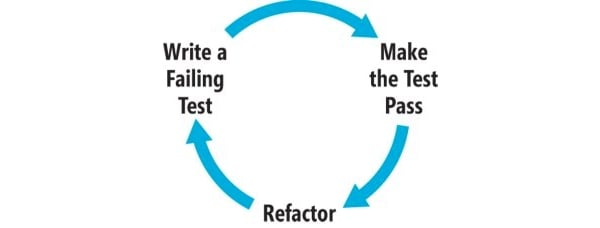

# Introdução ao TDD
Um guia prático de métodos de desenvolvimento de software.

---

### Três Regras do TDD

 O TDD pode ser descrito em 3 regras simples:
 * Não escreva nenhum código de produção antes de elaborar um teste que falhou pela ausência desse código;
 * Não escreva mais testes do que o suficiente para identificação da falha;
 * Não escreva mais código do que o suficiente para passar nos testes

 > Em outras palavras, o conceito é de que escreva um teste antes de implementar algum método no seu código. 

 Ao seguir as Três Regras, os testes desenvolvidos se tornam os exemplos de código para o app. 
 Por exemplo, se você quiser chamar uma determinada função da API existirão testes que chamam essa função de todas as formas possíveis, tornando mais prático entender o que deverá ser feito e garantindo maior consistência no produto.

 

 Quando se tem uma suíte de testes completa não há receios de alterar o código, facilitando a manutenção e *refatoração*. Com a refatoração contínua de código os passos a serem seguidos para se manter o TDD são:
 * **Escreva um teste que falha** de acordo com a lógica da função;
 * **Faça a função passar no teste** escrevendo o código *necessário* para que funcione juntamente aos demais testes;
 * **Refatore a implementação** ***reescrevendo e atualizando o código para aumento de qualidade***

 ## SOLID
 **SOLID** é uma abreviação para 5 princípios da Orientação a Objetos:
 1. **S**ingle Responsability principle;
 2. **O**pen/Closed principle;
 3. **L**iskov Substitution principle;
 4. **I**nterface Segregation principle;
 5. **D**ependency Invertion principle

 

